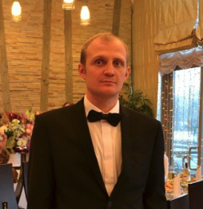
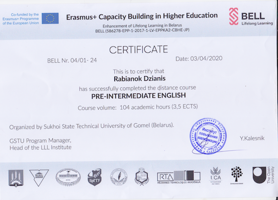

# Резюме на должность «Технический писатель»

## Ребенок Денис Васильевич

*Год рождения:* 1985

*Место проживания:* г. Гомель, г. Тверь

*Гражданство:* Российская Федерация

*Телефон:* 89108306250

*E-mail:* denmaloyreb@mail.ru

*Telegram:* @Denis_Malov

## Образование

**август 2002 года – июль 2007 года** – УО Военная Академия Республики Беларусь, факультет связи и АСУ, инженер по телекоммуникациям.

**октябрь 2017 года – октябрь 2019 года** – ИПК и ПК ГГТУ им. П.О. Сухого, инженер-программист.

## Опыт трудовой и профессиональной деятельности
**июль 2007 – 2012 гг.** – Прохождение службы на различных офицерских должностях (от преподавателя учебного центра до старшего помощника отделения оперативной и боевой подготовки). *Функциональные обязанности: обучение личного состава, работа с документацией, обеспечение выполнения подразделением задач по предназначению.*

**июль 2012 – декабрь 2014** – ЧУП «Вебком медиа», позже ООО «Вебком медиа», редактор интернет-ресурса. *Функциональные обязанности: подготовка текстового контента для сайтов.*

**декабрь 2014 г. – наст.вр** –  ИП, фрилансер, IT-копирайтер, редактор, HTML-верстальщик. Специализируюсь на технических темах. *Функциональные обязанности: подготовка текстового контента для клиентских интернет-ресурсов (SEO-агентства, компании, занимающиеся разработкой, внедрением, поддержкой ПО, системные интеграторы).* 
### Примеры работ:

**Инструкции (руководства):**

[Продвижение сайта самостоятельно — инструкция по SEO с нуля](https://studiobit.ru/blog/seo-and-reklama/seo-prodvizhenie-sayta-samostoyatelno/)

[Как загрузить сайт на хостинг](https://gmhost.com.ua/kak-zagruzit-sayt-na-hosting)

[5 правил для создания безопасного пароля, который легко запомнить](https://afforto.ru/company/blog/5_pravil_dlya_sozdaniya_bezopasnogo_parolya_kotoryy_legko_zapomnit/)

[НАСТРАИВАЕМ ТЕРМИНАЛЬНЫЙ СЕРВЕР НА ПРИМЕРЕ ОС WINDOWS SERVER 2012 R2](https://www.itmain.ru/terminalnij-server-2012-r2.html)

**Информационные статьи**

[Управление пользователями баз данных. Для блога одного из продуктов "Ростелеком"](https://rt-solar.ru/products/solar_inrights/blog/2340/)

[Принцип работы DLP-системы: как устроены современные DLP-системы. Для блога одного из продуктов "Ростелеком"](https://rt-solar.ru/products/solar_dozor/blog/2181/)

[Что нужно знать о защите домашнего или офисного роутера](https://club.esetnod32.ru/articles/analitika/routery-zashchita/)

[Веб-разработчики: Frontend vs Backend](https://uncore.ru/blog/development/web-razrabotchiki-frontend-vs-backend/)

[Защита ЭЦП: от чего, зачем и как защищать](https://club.esetnod32.ru/articles/analitika/zashchita-etsp-ot-chego-zachem-i-kak-zashchishchat/)

[«Плюшки» в IT-компаниях. Чего хотят разработчики и что предлагают работодатели](https://indigo.co.ua/plyushki-v-it-kompaniyah-chego-hotyat-razrabotchiki-i-chto-predlagayut-rabotodateli/)

**Обзоры, тесты, «товарные» страницы:**

[UTINET UTHIN. Текст для добавления программного продукта в Росреестр](https://utinet.group/uthin/)

[Тестирование сервисов для определения уникальности текстов](http://protext.by/blog/o-kopirajtinge-vserez/advego-plagiatus-sucks/)

[Описание решения для мониторинга сетевого оборудования, серверов и СХД](https://utinet.group/uview/)

[Системы хранения данных — СХД](https://www.azone-it.ru/sistema-hraneniya-dannyh-shd?fbclid=IwAR16AwRFjvxCcCNTOuyw1RFihGKwNvAdLRL9IvvbRwHtnWBoGdY46JQyPVA)

## Уровень английского языка

**B1.**

## Навыки и умения
Владею технологиями/инструментами:

* HTML
* CSS,
* JavaScript,
* Git,
* Markdown,
* VSCode.

Имею базовые знания в PHP, SQL, ООП, CMS WordPress.

## Личные качества

* **Обучаемость.** Быстро усваиваю новые знания. Постоянно совершенствую свои знания, навыки и умения. Готов к обучению.

* **Многозадачность.** Способен работать над несколькими разноплановыми задачами одновременно. 

* **Пунктуальность.** Выполняю работу в срок. Адекватно оцениваю задачи. 

* **Дисциплинированность.** Соблюдаю субординацию, тактичный, уважительно отношусь к коллегам, клиентам.

* **Амбициозность.** Нацелен на развитие и карьерный рост.

## Коротко обо мне

Всегда тяготел к точным наукам и технике и высоким технологиям. В период прохождения службы в ВС (Вооруженных Силах) после окончания Академии увлекся работой в интернете, т.к. хотелось постоянно получать какую-то новую информацию и видеть результат своей работы.

Копирайтингом я занимаюсь с 2010 года. Сначала это происходило по совместительству с основной работой (служба в ВС РБ). В 2012 году я уволился из ВС в запас и стал заниматься ТОЛЬКО копирайтингом.
После окончания контакта в ВС устроился в компанию ProText (подразделение Webcom Media, г. Минск). Параллельно развивал собственный проект. В последующем, наработав опыт и имя в копирайтинге, ушел во фриланс. 

Пишу тексты преимущественно на технические и IT-темы, провожу консультации и мастер-классы для новичков. Есть опыт преподавания (при прохождении службы в ВС занимал должность преподавателя учебного центра). 
Слежу за новыми технологиями. Стремлюсь получать новые полезные знания и навыки. 

Со временем начал понимать, что мне интересно программирование и решил поступить в ИПК ГГТУ им П.О. Сухого. Интерес именно к web-программированию: JavaScript, PHP, HTML, CSS.

